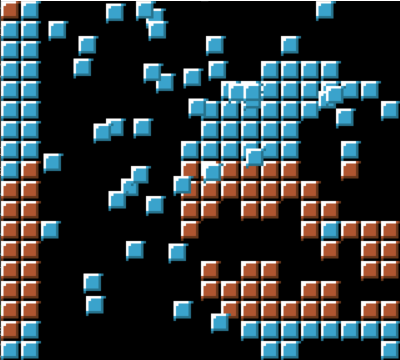

"Millfork-Platforms" 

Dumping ground for platform support for https://github.com/KarolS/millfork

Simple demo's to set up a specific system and get graphics and sprites and input working.

So far Gameboy Color,MSX, and Sega Master System are available. 

Mega65. 

very preliminary Mega65 target support. can build a <64kb prg and run.

MSX support.

Sega Master System support.

Gameboy Color support. ( extended original GB files ) 

