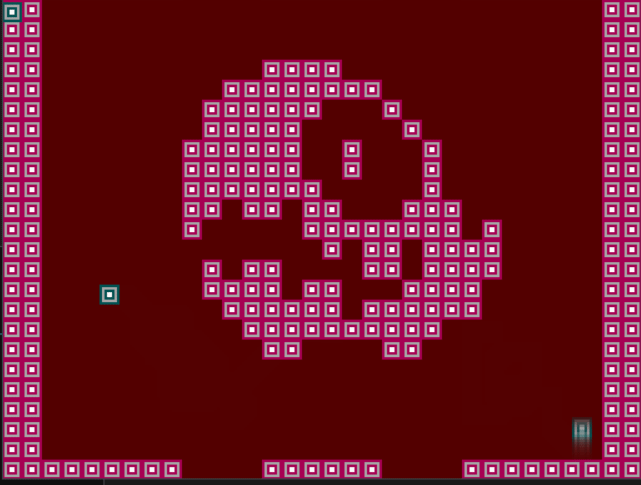
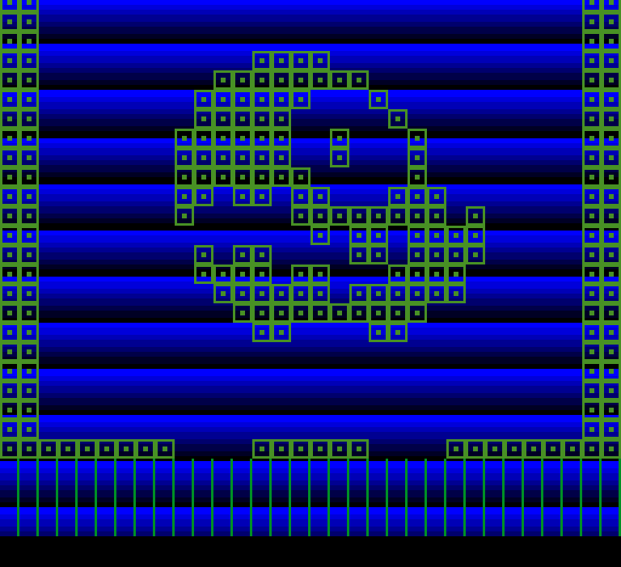

"Millfork-Platforms" 

Dumping ground for platform support.

Simple demo's to set up a specific system and get graphics and sprites and input working.

So far MSX and Sega Master System is available. 

MSX support.

Sega Master System support.

Preliminary PC Engine support.
Vsync doesn't work. No sprite or input support as yet.

